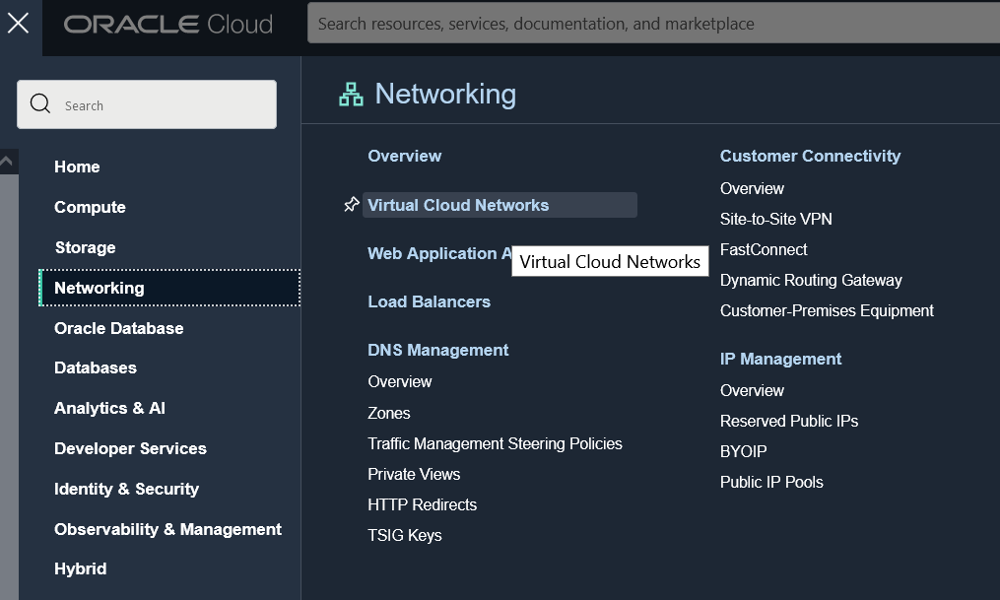
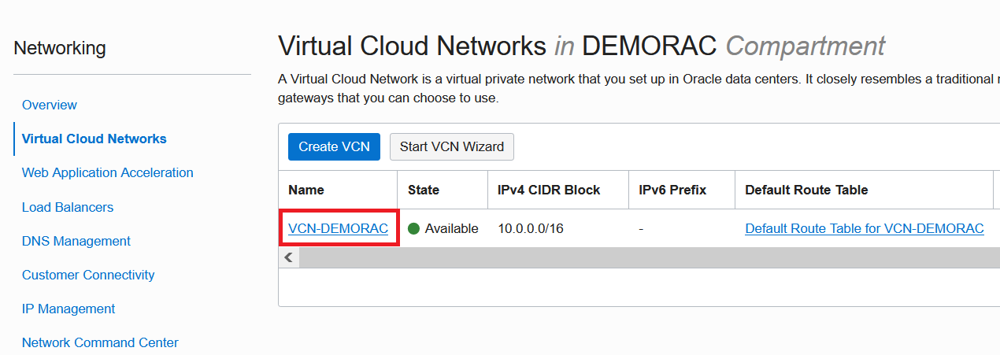

# Configure the application environment

## Introduction

In this lab we will customize the environment that will be used to run the rest of the workshop.

> **Note**: Most components should have been pre-created.

There are three main elements in our environment:

* A **Virtual Cloud Network (VCN)** has been pre-created. It represents the network topology inside the Oracle Cloud by defining the following components (Subnets, Route Tables, Security Lists, Gateways, etc.).
* A two-node **DBCS RAC database** with ASM storage (which should have also been pre-created).
* A **Compute instance** which is a VM hosting our demo application.

Estimated Lab Time: 30 minutes.


### Objectives

In this lab, you will:

* Complete the network configuration
* Configure RAC database services
* Create a demo schema in the database
* Compile a demo application


### Prerequisites

This lab assumes you have:
* An Oracle LiveLabs sandbox environment
* Or an Oracle Free Tier, Always Free, Paid or LiveLabs Cloud Account - You can check Getting Started section for more information.


## Task 1: Configure networking

1. Create a **Network Security Group** rule allowing Oracle Net connectivity.

* First create the NSG...






* Then add a stateful ingress rule allowing Oracle connectivity within the VCN:


2. Add ONS egress/ingress rules


## Task 2: Configure RAC services

1. Check that ONS is running on the server

* Using Cloud Shell, connect to the first node of the RAC cluster as **opc** and switch to the **oracle** user

````
$ <copy>Optional copy of values</copy>

francois_p@cloudshell:~ (eu-paris-1)$ <copy>ssh -i fpkey opc@[node 1 public IP]</copy>
(...)
Are you sure you want to continue connecting (yes/no)? yes
Warning: Permanently added 'xxx' (ECDSA) to the list of known hosts.
````

* switch to *oracle*
````
$ <copy>sudo su - oracle</copy>
````

````
[oracle@ruby1 ~]$ <copy>srvctl status nodeapps</copy>
VIP 10.0.0.183 is enabled
VIP 10.0.0.183 is running on node: ruby1
VIP 10.0.0.80 is enabled
VIP 10.0.0.80 is running on node: ruby2
Network is enabled
Network is running on node: ruby1
Network is running on node: ruby2
ONS is enabled
ONS daemon is running on node: ruby1
ONS daemon is running on node: ruby2
````


2. Standard service (no Application Continuity)
3. New service (with Application Continuity support)
4. Create TNS aliases in tnsnames.ora for the 2 services


## Task 3: Create demo schema

1. Create tablespace and user
2. Create  schema


## Task 4: Compile demo application

1. Download libraries and set CLASSPATH
2. Build the JDBC URL for the connection pool
3. Compile demo


**You can proceed to the next lab…**


## Acknowledgements
* **Author** - François Pons, Senior Principal Product Manager
* **Contributors** - Andrei Manoliu, Principal Product Manager
* **Last Updated By/Date** - François Pons, July 2022
