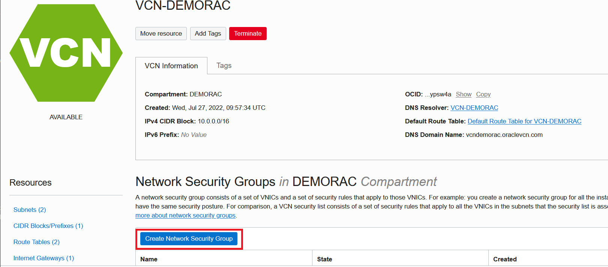
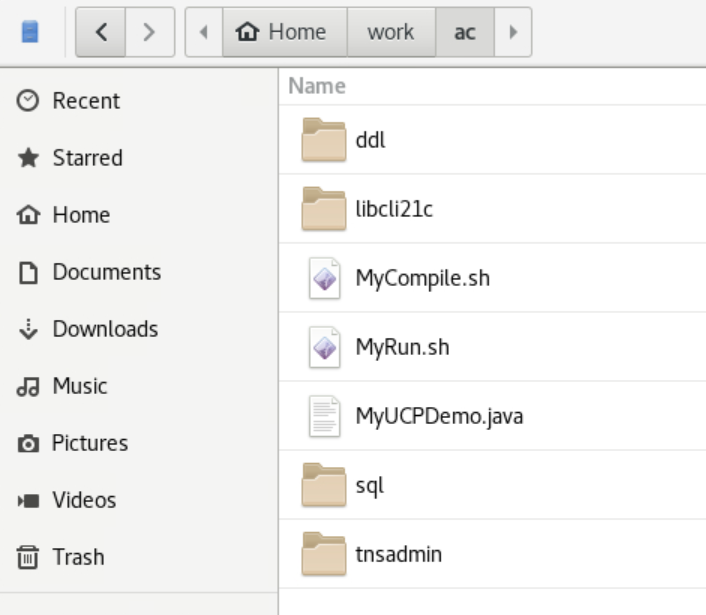
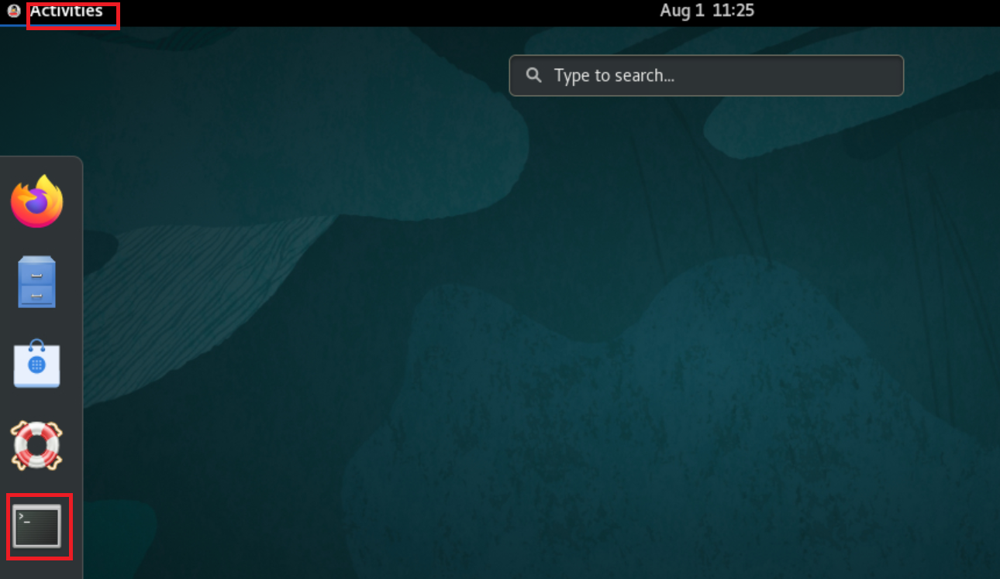
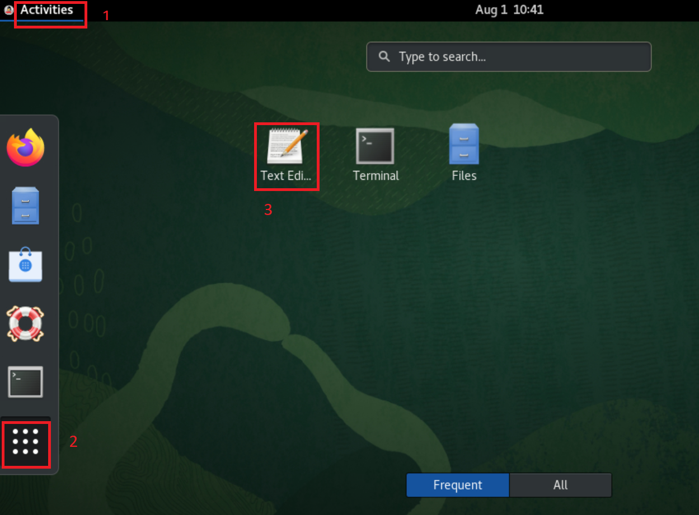
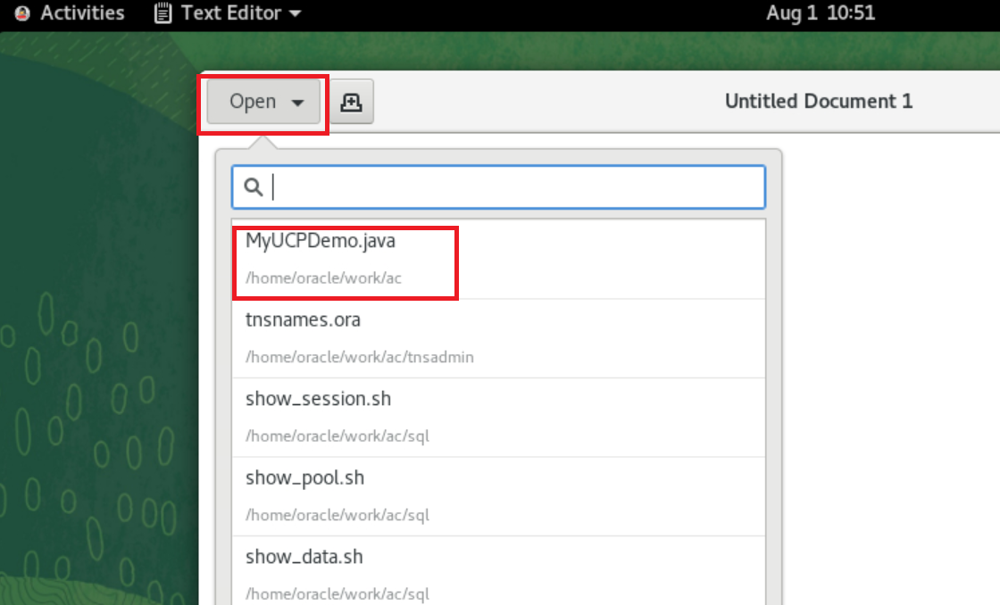
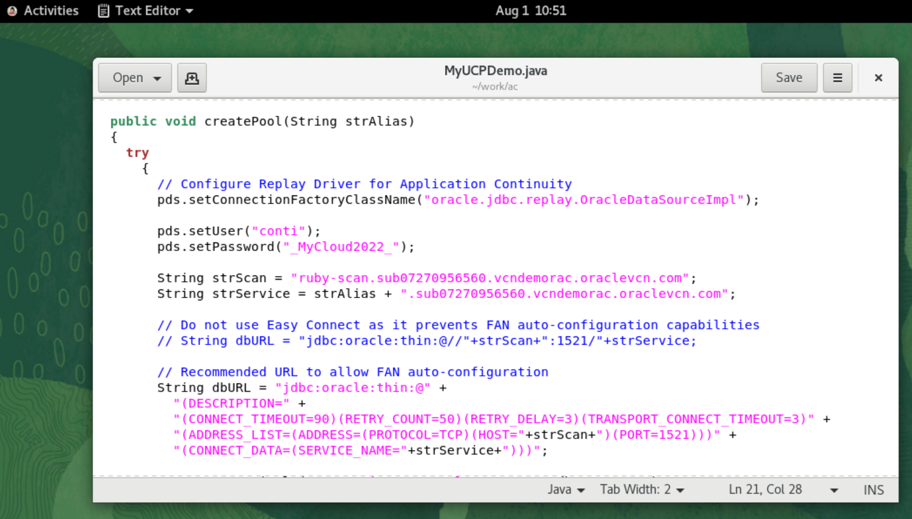

# Configure the application environment

## Introduction

In this lab we will customize the environment that will be used to run the rest of the workshop.

> **Note**: Most components should have been pre-created.

There are three main elements in our environment:

* A **Virtual Cloud Network (VCN)** has been pre-created. It represents the network topology inside the Oracle Cloud by defining the following components (Subnets, Route Tables, Security Lists, Gateways, etc.).
* A two-node **DBCS RAC database** with ASM storage (which should have also been pre-created).
* A **Compute instance** which is a VM hosting our demo application.

Estimated Lab Time: 30 minutes.


### Objectives

In this lab, you will:

* Complete the network configuration
* Configure RAC database services
* Create a demo schema in the database
* Compile a demo application


### Prerequisites

This lab assumes you have:
* An Oracle LiveLabs sandbox environment
* Or an Oracle Free Tier, Always Free, Paid or LiveLabs Cloud Account - You can check Getting Started section for more information.


## Task 1: Configure the network for Oracle Net

1. Create a **Network Security Group** rule allowing Oracle Net connectivity


* From the Oracle Cloud web console, go to **Networking** and select your VCN. It should be named **VCN-DEMORAC**.


* Select the VCN


Then click on **Network Security Group** under **Resources** to create a Network Security Group in the VCN.



* Enter a name and create the Network Security Group

````
Enter <copy>NSG-DEMORAC</copy> in the Name field.
````

2. Then add a **stateful ingress rule** allowing Oracle Net connectivity within the VCN


3. Finally add the NSG to the database


## Task 2: Configure the network for Oracle Notification Services

1. Check that ONS is running on the server

* Using Cloud Shell, connect to the first node of the RAC cluster as **opc** and switch to the **oracle** user

  ````
  user@cloudshell:~ $ <copy>ssh -i fpkey opc@[node 1 public IP]</copy>

  (...)
  Are you sure you want to continue connecting (yes/no)? yes
  Warning: Permanently added 'xxx' (ECDSA) to the list of known hosts.
  (...)
  ````

* Switch to user *oracle*

  ````
  $ <copy>sudo su - oracle</copy>
  ````

* Check ONS is running on the server

  ````
  [oracle@ruby1 ~]$ <copy>srvctl status nodeapps</copy>

  VIP 10.0.0.183 is enabled
  VIP 10.0.0.183 is running on node: ruby1
  VIP 10.0.0.80 is enabled
  VIP 10.0.0.80 is running on node: ruby2
  Network is enabled
  Network is running on node: ruby1
  Network is running on node: ruby2
  ONS is enabled
  ONS daemon is running on node: ruby1
  ONS daemon is running on node: ruby2
  ````

* Also verify the ports used by ONS

  ````
  [oracle@ruby1 ~]$ <copy>srvctl config nodeapps -s</copy>

  [oracle@ruby1 ~]$ srvctl config nodeapps -s
  ONS exists: Local port 6100, remote port 6200, EM port 2016, Uses SSL true
  ONS is enabled
  ONS is individually enabled on nodes:
  ONS is individually disabled on nodes:
  ````

2. Add an ingress rule opening TCP port 6200 to FAN events

Fast Application Notification (FAN) requires the following **ingress** rule to be added to the Network Security Group in order to allow the propagation of FAN events to the connection pool.


## Task 3: Configure RAC services

1. Using Cloud Shell, connect to the first node of the RAC cluster as **opc** and switch to the **oracle** user

  ````
  user@cloudshell:~ $ <copy>ssh -i fpkey opc@[node 1 public IP]</copy>
  ````

* Switch to user *oracle*

  ````
  $ <copy>sudo su - oracle</copy>
  ````


2. Create a database service with standard parameters (no Application Continuity)

* Create the service **demosrv**:

  ````
  user@cloudshell:~ $ <copy>srvctl add service -db cont_prim -service demosrv -preferred CONT1,CONT2 -pdb PDB1 -notification TRUE -drain_timeout 300 -stopoption IMMEDIATE -role PRIMARY</copy>
  ````

* Check service configuration:

  ````
  user@cloudshell:~ $ <copy>srvctl config service -db cont_prim -service demosrv</copy>

  Service name: **demosrv**
  Server pool:
  Cardinality: 2
  Service role: PRIMARY
  Management policy: AUTOMATIC
  DTP transaction: false
  AQ HA notifications: true
  Global: false
  Commit Outcome: false
  Failover type:
  Failover method:
  Failover retries:
  Failover delay:
  Failover restore: NONE
  Connection Load Balancing Goal: LONG
  Runtime Load Balancing Goal: NONE
  TAF policy specification: NONE
  Edition:
  Pluggable database name: PDB1
  Hub service:
  Maximum lag time: ANY
  SQL Translation Profile:
  Retention: 86400 seconds
  Replay Initiation Time: 300 seconds
  Drain timeout: 300 seconds
  Stop option: immediate
  Session State Consistency: DYNAMIC
  GSM Flags: 0
  Service is enabled
  Preferred instances: CONT1,CONT2
  Available instances:
  CSS critical: no
  ````

> **Note**: failover type is not set.

* Start the service and check its status

````
user@cloudshell:~ $ <copy>srvctl start service -db cont_prim -service demosrv</copy>
````

````
user@cloudshell:~ $ <copy>srvctl status service -db cont_prim -service demosrv</copy>

Service demosrv is running on instance(s) CONT1,CONT2
````

> **Note**: the service should run on all the preferred instances.


* If you need to delete the service and create it again, use the following command:

  ````
  user@cloudshell:~ $ <copy>srvctl remove service -db cont_prim -service demosrv</copy>
  ````

3. Create a database service with Application Continuity support

* Create the service **tacsrv**:

  ````
  user@cloudshell:~ $ <copy>srvctl add service -db cont_prim -service tacsrv -pdb PDB1 -preferred CONT1,CONT2 -failover_restore AUTO -commit_outcome TRUE -failovertype AUTO -replay_init_time 600 -retention 86400 -notification TRUE -drain_timeout 300 -stopoption IMMEDIATE -role PRIMARY</copy>
  ````

* Check service configuration

  ````
  user@cloudshell:~ $ <copy>srvctl config service -db cont_prim -service tacsrv</copy>

  Service name: **tacsrv**
  Server pool:
  Cardinality: 2
  Service role: PRIMARY
  Management policy: AUTOMATIC
  DTP transaction: false
  AQ HA notifications: true
  Global: false
  Commit Outcome: true
  Failover type: **AUTO**
  Failover method:
  Failover retries: 30
  Failover delay: 10
  Failover restore: AUTO
  Connection Load Balancing Goal: LONG
  Runtime Load Balancing Goal: NONE
  TAF policy specification: NONE
  Edition:
  Pluggable database name: PDB1
  Hub service:
  Maximum lag time: ANY
  SQL Translation Profile:
  Retention: 86400 seconds
  Replay Initiation Time: 600 seconds
  Drain timeout: 300 seconds
  Stop option: immediate
  Session State Consistency: AUTO
  GSM Flags: 0
  Service is enabled
  Preferred instances: CONT1,CONT2
  Available instances:
  CSS critical: no
  ````

> **Note**: failover type is set to **AUTO**.


* Start the service and check its status

````
user@cloudshell:~ $ <copy>srvctl start service -db cont_prim -service tacsrv</copy>
````

````
user@cloudshell:~ $ <copy>srvctl status service -db cont_prim -service tacsrv</copy>

Service tacsrv is running on instance(s) CONT1,CONT2
````

> **Note**: the service should run on all the preferred instances.


* If you need to delete the service and create it again, use the following command:

  ````
  user@cloudshell:~ $ <copy>srvctl remove service -db cont_prim -service tacsrv</copy>
  ````


## Task 4: Create the demo schema


1. Understand the demo application directory structure

The demo application is installed under the **oracle** user of the client machine **demotac** in **/home/oracle/work/ac**





Here is a description of the directory structure under **/home/oracle/work/ac**:

* **ac** : demo program with its compiling and running scripts
* **ac/libcli21c** : required java libraries
* **ac/ddl** : SQL scripts to create the demo schema
* **ac/sql** : SQL scripts used later in the lab to show data and how connections are created


2. Open a terminal window (as oracle) and change directory to $HOME/work/ac/ddl



  ````
  user@cloudshell:~ $ <copy>cd $HOME/work/ac/ddl ; ls -al</copy>

  (...)
  -rw-r--r--. 1 oracle oinstall 1047 Jul 29 09:27 ddl10_user.sql
  -rw-r--r--. 1 oracle oinstall 1036 Jul 29 09:27 ddl20_schema.sql
  -rwxr-xr-x. 1 oracle oinstall   64 Jun 28 07:50 ddl_setup.sh
  (...)
  ````

3. Run **ddl_setup.sh** to create the demo schema

> **Note**: Ignore the error on DROP TABLESPACE if you are running the script for the first time.

This script essentially connects to the RAC database and creates a user CONTI in PDB1.

CONTI will connect to the Pluggable database PDB1 to make accounting entries in table ACCOUNT.

Each accounting transaction should consist of two lines in ACCOUNT: one with DIR='D' (for Debit) and another one with DIR='C' (for Credit).

A trigger allows to capture the database service that was used to connect when INSERT statements are executed.


  ````
  user@cloudshell:~ $ <copy>./ddl_setup.sh</copy>

  (...)
  SQL> drop user conti cascade;
  User dropped.

  SQL> drop tablespace conti including contents and datafiles;
  Tablespace dropped.

  SQL> create smallfile tablespace conti
    2   datafile '+DATA'	size 100M reuse autoextend on next 100m
    3   maxsize unlimited
    4   logging
    5   extent management local segment space management auto;
  Tablespace created.

  SQL> create user conti identified by "_MyCloud2022_" default tablespace conti account unlock;
  User created.

  SQL> grant connect, resource, unlimited tablespace to conti;
  Grant succeeded.

  (...)
  SQL> connect conti/_MyCloud2022_@ruby-scan.sub07270956560.vcndemorac.oraclevcn.com:1521/PDB1.sub07270956560.vcndemorac.oraclevcn.com
  Connected.
  SQL> --
  SQL> -- Create demo schema in ADB
  SQL> --

  SQL> create table account(
    2  id 	         number(12,0),
    3  date_create   date,
    4  service	     varchar2(60),
    5  dir	         char(1),
    6  amount	       number
    7  );
  Table created.

  SQL> create unique index account_pk on account(id);
  Index created.

  SQL> alter table account add constraint pk_account primary key (id) using index;
  Table altered.

  SQL> create sequence account_seq start with 1;
  Sequence created.

  SQL> -- Retaining Mutable Values in Application Continuity for Java
  SQL> ALTER SEQUENCE account_seq KEEP;
  Sequence altered.

  SQL> create or replace trigger biur_account
    2  before insert on account
    3  for each row
    4  begin
    5  	     select sysdate into :new.date_create from dual;
    6  	     select account_seq.nextval into :new.id from dual;
    7  	     select service_name into :new.service from v$session where audsid=userenv('sessionid');
    8  end biur_account;
    9  /
  Trigger created.
  (...)
  ````


## Task 5: Compile demo application


1. Required CLASSPATH libraries

Our demo program uses JDBC to connect to the RAC database.
It shows how to create an intelligent connection pool, able to communicate with the cluster database through the Oracle Notification Service.

To compile and run such a Java program, you need:
* the right jdbc driver (usually ojdbcX.jar)
* the right Universal Connection Pool jar file (usually ucp.jar or ucp11.jar)
* the Oracle Notification Service jar file (usually ons.jar)

The jar files you need depend on:
* the version of your Oracle client
* the version of Java you are using
* the version of the database you connect to (to a lesser extent)

Oracle Database JDBC drivers and Companion Jars can be downloaded from [here](https://www.oracle.com/database/technologies/appdev/jdbc-downloads.html).

In our case we are using:
* JDK 11
* Oracle 21c instant client
* Oracle 19c database


The jar files you need in your **CLASSPATH** have already been downloaded to **work/ac/libcli21c**

````
user@cloudshell:~ $ <copy>cd $HOME/work/ac/libcli21c ; ls -al</copy>

(...)
-rw-r--r--. 1 oracle oinstall 5175363 Jun  9 01:44 ojdbc11.jar
-rw-r--r--. 1 oracle oinstall  198457 Jun  9 01:44 ons.jar
-rw-r--r--. 1 oracle oinstall 1801328 Jun  9 01:44 ucp11.jar
(...)
````

2. Build the JDBC URL for the connection pool

From the desktop connection as oracle to the client machine, use the text editor to edit the Java program









The most interesting method is **createPool(String strAlias)** which shows the commands to create a connection pool able to take full advantage of a RAC database.

Notice the following elements:

* the call to configure Replay Driver for Application Continuity

<code>pds.setConnectionFactoryClassName("oracle.jdbc.replay.OracleDataSourceImpl");</code>

* the connection URL which should be of the following form to allow FAN auto-configuration

<code>
String dbURL = "jdbc:oracle:thin:@" +
	"(DESCRIPTION=" +
	"(CONNECT_TIMEOUT=90)(RETRY_COUNT=50)(RETRY_DELAY=3)(TRANSPORT_CONNECT_TIMEOUT=3)" +
	"(ADDRESS_LIST=(ADDRESS=(PROTOCOL=TCP)(HOST="+strScan+")(PORT=1521)))" +			
	"(CONNECT_DATA=(SERVICE_NAME="+strService+")))";
</code>

* usual instructions to configure the number of connections in the pool

<code>
pds.setInitialPoolSize(1);
pds.setMinPoolSize(1);
pds.setMaxPoolSize(20);
</code>

* some additional commands which speak for themselves

<code>
pds.setFastConnectionFailoverEnabled(true);
pds.setValidateConnectionOnBorrow(true);
</code>


**Verify the value of strScan and change it in MyCUPDemo.java if necessary.**


3. Compile the demo application

Open a terminal window change to the ac directory:

````
user@cloudshell:~ $ <copy>cd /home/oracle/work/ac</copy>
````

Then run the following command to compile the demo application:

````
user@cloudshell:~ $ <copy>MyCompile.sh MyUCPDemo.java</copy>
````


**You can proceed to the next lab.**


## Acknowledgements
* **Author** - François Pons, Senior Principal Product Manager
* **Contributors** - Andrei Manoliu, Principal Product Manager
* **Last Updated By/Date** - François Pons, August 2022
