# Setup OCI Resources

## Introduction

Welcome to Lab 1. This workshop demonstrates how to set up Oracle Cloud Infrastructure (OCI) resources to enable Oracle APEX to access Oracle Object Storage. The lab focuses on two main areas: Identity Setup and Bucket Setup. By the end of this lab, you will have a functional compartment and policies for managing your cloud resources, as well as a properly configured bucket for storing and managing your objects in OCI.

In the Identity Setup section, you will learn how to create compartments, manage policies, and set up users with the necessary permissions to interact with OCI resources. Following this, the Bucket Setup section will walk you through the process of creating and configuring a storage bucket, essential for managing data and objects in your cloud environment.

Estimated Time: 10 minutes

## Objectives

By completing this lab, you will achieve the following objectives:

* **View the existing compartment** for managing resources in OCI.
  * This involves setting up a logical grouping for your resources to enhance management and organization.
  
* **Set up a user specifically for API key management and interaction.**
  * This step ensures that there is a dedicated user with appropriate permissions for managing and using API keys securely.

* **Configure API keys for secure access and operations.**
  * You will generate and set up API keys to enable secure programmatic access to your OCI resources.

* **Obtain necessary OCIDs** for compartments, users, and tenancies.
  * OCIDs (Oracle Cloud Identifiers) are essential for uniquely identifying your resources in OCI.

* **Create and configure a storage bucket in OCI.**
  * This section guides you through setting up a storage bucket, a crucial component for storing and managing data in your cloud environment.

* **Generate a Pre-Authenticated Request (PAR) for secure bucket access.**
  * You will create a PAR to enable secure and temporary access to your storage bucket without requiring further authentication.

## Task 1: View the OCI Compartment OCID

**Some regions don't offer all the models. See the region for each pretrained model to find out which models are available in a region near you. [Oracle Generative AI Overview](https://docs.oracle.com/en-us/iaas/Content/generative-ai/overview.htm)**

A Livelabs compartment was created in the workshop provivioning stage. You can seve the Compartment OCID from the Longin Info Page.

 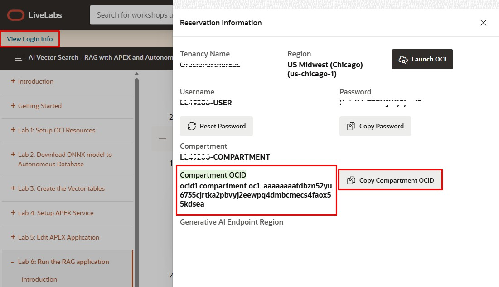

## Task 2: Save User OCID and Create API Keys

1. Click the profile icon in the top right of your OCI page, and click My Profile.
  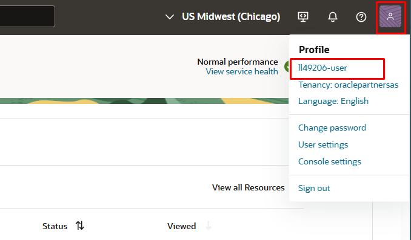
2. Save the user OCID for later use.
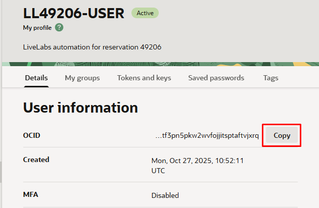

## Task 3: Create OCI API Key

1. Select Tokens and keys tab and add api key.
    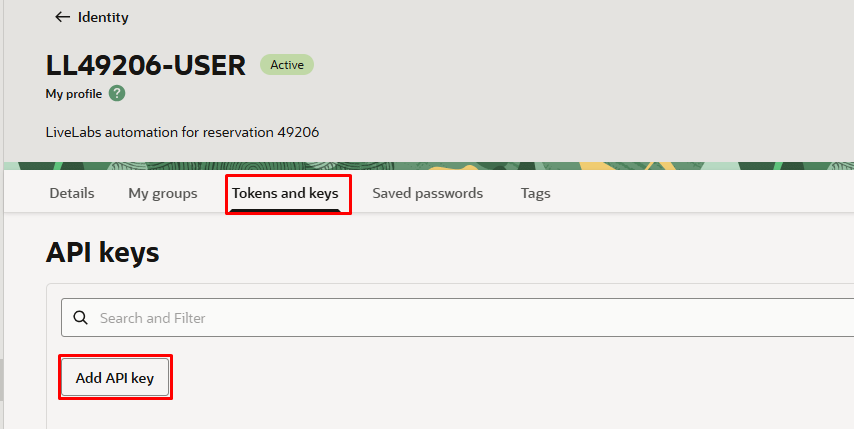
2. Click on Generate API key pair and download the private key and public key.
    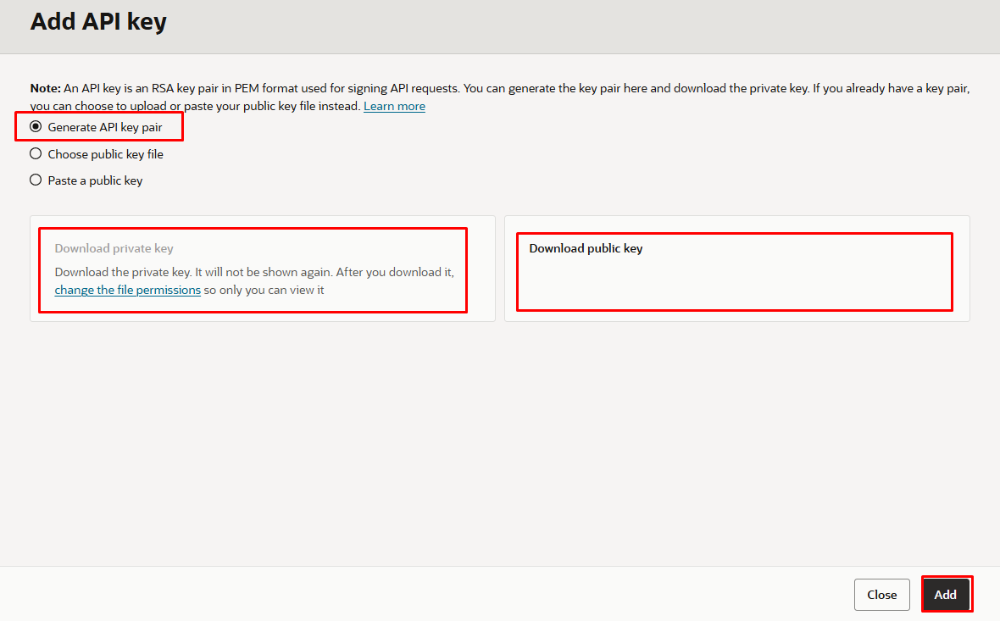
3. Save the contents of the private key in a separate document.
4. View the configuration file and select the copy button and save it in a separate document for later use.
    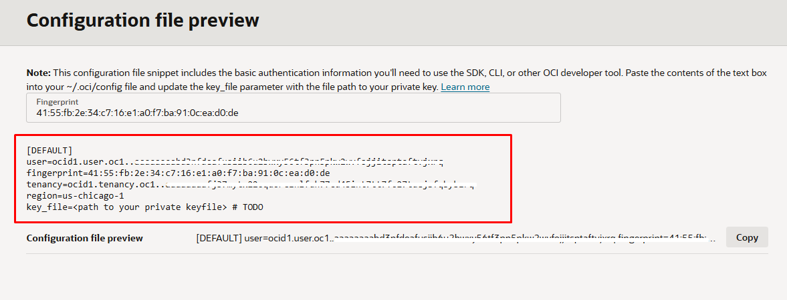
5. Go ahead and close the tab after you have saved the contents.

## Task 4: Create a Bucket

In Oracle Object Storage, a bucket is a container for storing objects. To access a bucket through the Oracle Cloud Infrastructure REST APIs, complete the following identity management tasks using the Oracle Cloud Infrastructure console and an account that has administrative rights within the tenancy (the root compartment).

1. Log in to the Oracle Cloud Infrastructure console as an administrator.
2. Click the hamburger icon (≡), select  Storage, and under the Object STorage & Archive Storage clike on Buckets.
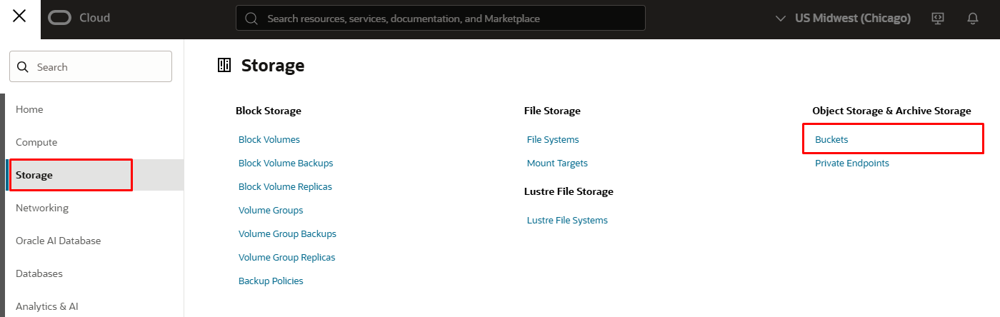

3. Select your Compartment. You may have to drill in (click “+”) to see your compartment under LiveLabs.
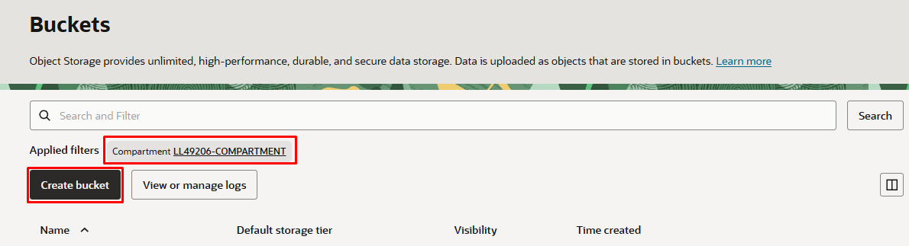
4. Click Create Bucket and provide the following information in the corresponding fields:
    * **Bucket Name**: Enter `apex_file_storage`, for example.
    * **Storage Tier**: Select Standard.
    * **Encryption**: Select Encrypt Using Oracle Managed Keys.
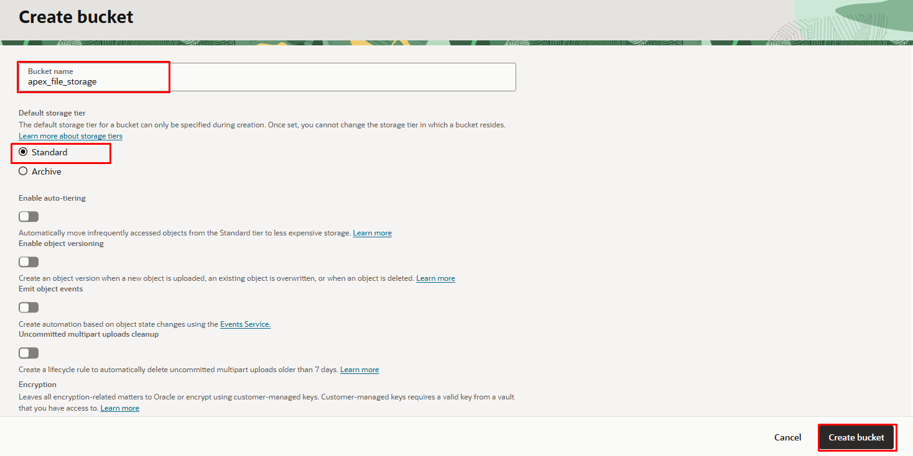
5. Click Create Bucket to complete the process.
6. To prepare for the successful creation and discovery of the WSM data profile later, upload a dummy file to the `apex_file_storage` bucket now using the Oracle Cloud Infrastructure console.

## Task 7: Create a Pre-Authenticated Request (PAR)

1. Click on the newly created bucket go to the Management tab and click on Create Pre-Auth Request.
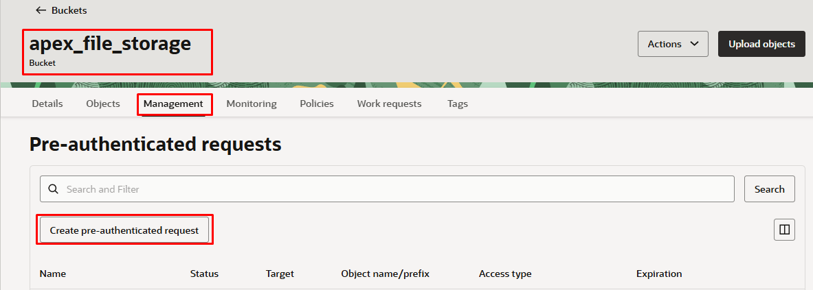
2. Name the bucket and permit object reads and writes, 
3. Enabling object listing.
3. Set the expiry date for the PAR to a time far in the future.
4. Click Create 
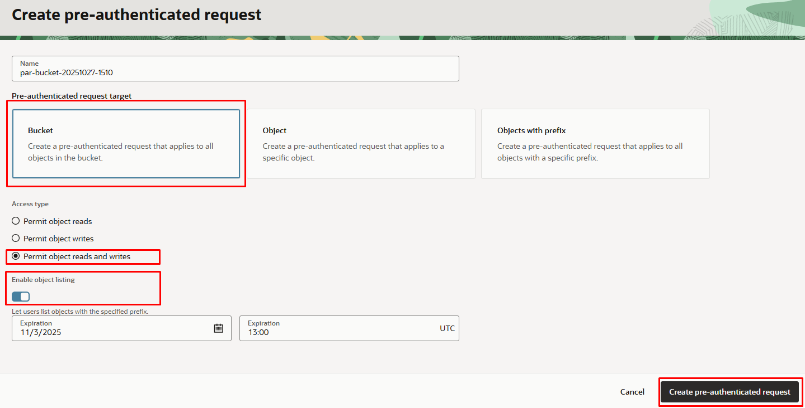
5. Save the pre-auth request URL in a document for later use.
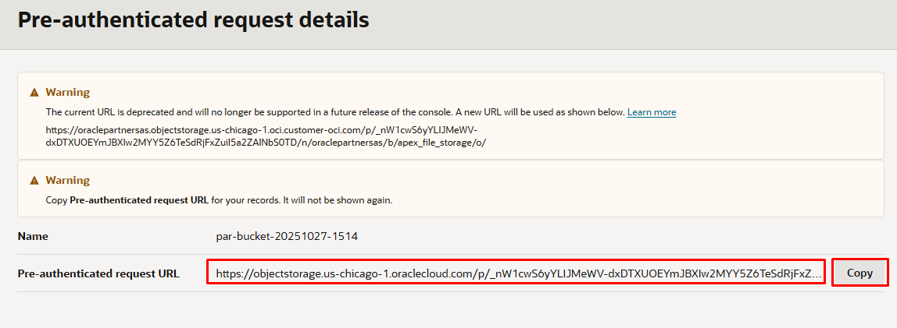

## Summary

You now know how to setup OCI using OCI console.

You may now [proceed to the next lab](#next).

## Acknowledgements

* **Authors** - Blake Hendricks, Milton Wan, Andrei Manoliu
* **Last Updated By/Date** -  Andrei Manoliu, October 2025
